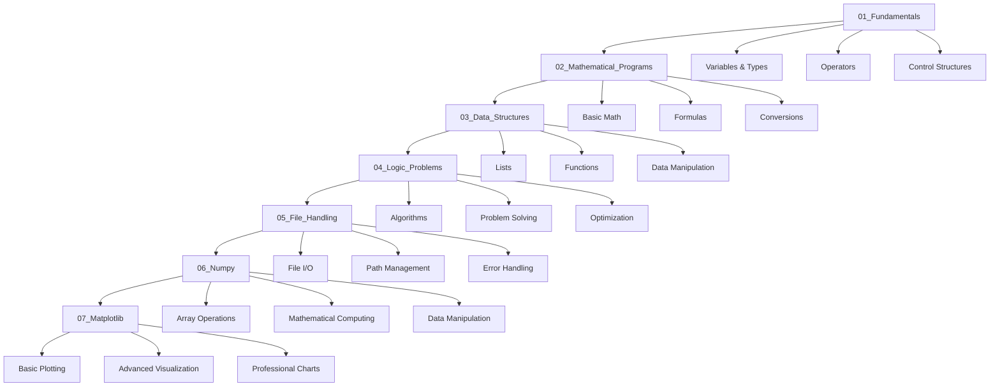

# 🐍 Python Programming Repository

<div align="center">


**A comprehensive collection of Python programs covering fundamental concepts, mathematical applications, data structures, and logical problem-solving.**

</div>

---

## 📂 Project Structure

```
Python/
├── 01_Fundamentals/           # Core Python concepts & syntax
├── 02_Mathematical_Programs/  # Mathematical calculations & formulas
├── 03_Data_Structures/        # Lists, functions, and data manipulation
├── 04_Logic_Problems/         # Algorithmic thinking & problem solving
├── 05_File_Handling/          # File operations & I/O management
├── 06_Numpy/                 # NumPy arrays & mathematical operations
├── 07_Matplotlib/            # Data visualization & plotting
└── README.md                  # Project documentation
```

---

## 🎯 01_Fundamentals

**Master Python basics with these foundational concepts:**

| File | Description |
|------|-------------|
| `astric.py` | Asterisk pattern operations |
| `comments_and_docstring_in_python.py` | Documentation best practices |
| `Datahandling.py` | Data type management |
| `decision_making_statement.py` | Conditional logic |
| `error_and_its_types.py` | Exception handling |
| `expressions_statements_precedence_of_operator.py` | Operator precedence |
| `first.py` | Hello World program |
| `logical_operator.py` | Boolean operations |
| `mode_float_double_float.py` | Numeric data types |
| `operator_and_its_types.py` | Comprehensive operator guide |
| `relations_operations.py` | Comparison operators |
| `repetition_looping_iteration.py` | Loop structures |
| `sequence_and_its_types.py` | Sequential data types |
| `types_of_decision_making_statement.py` | Advanced conditionals |
| `typesofstringin_python.py` | String manipulation |

---

## 🔢 02_Mathematical_Programs

**Solve real-world mathematical problems:**

| Program | Functionality | Input | Output |
|---------|---------------|--------|---------|
| [`quadratic_equation_solver.py`](02_Mathematical_Programs/quadratic_equation_solver.py) | Solves ax² + bx + c = 0 with discriminant handling | a, b, c coefficients | Real/Complex roots |
| [`cube_calculator.py`](02_Mathematical_Programs/cube_calculator.py) | Calculates cube of a number | Number | Cubed value |
| [`welcome_message_printer.py`](02_Mathematical_Programs/welcome_message_printer.py) | Custom welcome message generator | Message string | Formatted welcome |
| [`three_numbers_sum.py`](02_Mathematical_Programs/three_numbers_sum.py) | Sums three integers | 3 integers | Total sum |
| [`rectangle_area_calculator.py`](02_Mathematical_Programs/rectangle_area_calculator.py) | Rectangle area calculation | Length, breadth | Area |
| [`bmi_calculator.py`](02_Mathematical_Programs/bmi_calculator.py) | Body Mass Index calculator | Weight (kg), Height (m) | BMI value |
| [`km_to_miles_converter.py`](02_Mathematical_Programs/km_to_miles_converter.py) | Distance unit conversion | Kilometers | Miles |
| [`weight_converter.py`](02_Mathematical_Programs/weight_converter.py) | Weight unit conversion | Tonnes | Kg/Grams |
| [`number_swapper.py`](02_Mathematical_Programs/number_swapper.py) | Swaps two numbers | Two numbers | Swapped values |
| [`circle_calculator_menu.py`](02_Mathematical_Programs/circle_calculator_menu.py) | Circle area & perimeter calculator | Radius, choice | Area/Perimeter |
| [`arithmetic_calculator.py`](02_Mathematical_Programs/arithmetic_calculator.py) | Basic arithmetic operations | Two numbers, operator | Calculated result |

---

## 📊 03_Data_Structures

**Master Python data structures and operations:**

| File | Purpose |
|------|---------|
| [`comparing_lists.py`](03_Data_Structures/comparing_lists.py) | List comparison techniques |
| [`function.py`](03_Data_Structures/function.py) | Function definitions and usage |
| [`joining_lists.py`](03_Data_Structures/joining_lists.py) | List concatenation methods |
| [`list_operations.py`](03_Data_Structures/list_operations.py) | Comprehensive list operations |
| [`replicating_lists.py`](03_Data_Structures/replicating_lists.py) | List duplication techniques |
| [`slicing_lists.py`](03_Data_Structures/slicing_lists.py) | List slicing and indexing |
| [`test.py`](03_Data_Structures/test.py) | Testing and debugging examples |
| [`traversing_lists.py`](03_Data_Structures/traversing_lists.py) | List iteration methods |

---

## 🧠 04_Logic_Problems

**Develop algorithmic thinking with these challenges:**

| Program | Algorithm | Complexity | Key Concept |
|---------|-----------|------------|-------------|
| [`largest_of_three_numbers.py`](04_Logic_Problems/largest_of_three_numbers.py) | Comparison logic | O(1) | Conditional statements |
| [`even_odd_checker.py`](04_Logic_Problems/even_odd_checker.py) | Modulo operation | O(1) | Number properties |
| [`divisibility_checker.py`](04_Logic_Problems/divisibility_checker.py) | Division remainder | O(1) | Mathematical logic |
| [`sort_three_numbers.py`](04_Logic_Problems/sort_three_numbers.py) | Conditional sorting | O(1) | Nested conditions |
| [`multiplication_table_generator.py`](04_Logic_Problems/multiplication_table_generator.py) | Loop iteration | O(n) | For loops |
| [`factorial_calculator.py`](04_Logic_Problems/factorial_calculator.py) | Iterative multiplication | O(n) | Loop-based calculation |
| [`sum_of_digits.py`](04_Logic_Problems/sum_of_digits.py) | Digit extraction | O(log n) | While loops |
| [`number_reverser.py`](04_Logic_Problems/number_reverser.py) | Digit manipulation | O(log n) | Number processing |
| [`prime_number_checker.py`](04_Logic_Problems/prime_number_checker.py) | Primality testing | O(n) | Mathematical optimization |

---

## 📁 05_File_Handling

**Master file operations and I/O management:**

| Program | Functionality | Features | Key Concepts |
|---------|---------------|----------|--------------|
| [`file_reading_examples.py`](05_File_Handling/file_reading_examples.py) | Comprehensive file reading demonstration | Multiple reading methods, error handling, path resolution | File opening, context managers |
| [`comprehensive_file_operations.py`](05_File_Handling/comprehensive_file_operations.py) | Complete file operations showcase | Read, write, append, create, file properties | All file modes, metadata handling |
| [`append and write.py`](05_File_Handling/append%20and%20write.py) | Professional file writing operations | Writing, appending, overwriting, safe operations | File modes, error handling, best practices |
| [`pythonopen.py`](05_File_Handling/pythonopen.py) | Professional file opening techniques | Various opening methods, path management, safety | Modern file handling, pathlib usage |

### 📄 Supporting Files
- `demofile.txt` - Sample text file for testing operations
- `output.txt` - Generated by write operations  
- `README.md` - Detailed documentation for file handling

### 🎯 File Handling Concepts Covered
- **File Opening Modes**: `'r'`, `'w'`, `'a'`, `'x'` with text/binary options
- **Context Managers**: Using `with` statement for automatic resource management
- **Error Handling**: Comprehensive exception handling for file operations
- **Path Management**: Working with absolute/relative paths using `pathlib`
- **File Properties**: Checking size, modification time, existence
- **Safe Operations**: Preventing data loss with proper validation
- **Memory Efficiency**: Line-by-line processing for large files

---

## � 06_Numpy

**Master NumPy for numerical computing and data manipulation:**

| Program | Functionality | Features | Key Concepts |
|---------|---------------|----------|--------------|
| [`numpy_hello_world.py`](06_Numpy/numpy_hello_world.py) | Introduction to NumPy basics | Array creation, basic operations, printing | NumPy fundamentals, array basics |
| [`numpy_intro.py`](06_Numpy/numpy_intro.py) | Comprehensive NumPy introduction | Array creation, indexing, slicing, operations | Array manipulation, mathematical operations |
| [`array_creation_operations.py`](06_Numpy/array_creation_operations.py) | Array creation methods and operations | Multiple creation techniques, reshaping, copying | Array initialization, memory management |
| [`array_indexing_slicing.py`](06_Numpy/array_indexing_slicing.py) | Advanced indexing and slicing techniques | Multi-dimensional access, boolean indexing, fancy indexing | Array access patterns, data selection |
| [`numpy_getting_started_guide.py`](06_Numpy/numpy_getting_started_guide.py) | Complete getting started tutorial | Installation, basic usage, common patterns | NumPy workflow, best practices |

### 📊 NumPy Features Covered
- **Array Creation**: `np.array()`, `np.zeros()`, `np.ones()`, `np.arange()`, `np.linspace()`
- **Array Operations**: Mathematical operations, broadcasting, element-wise operations
- **Indexing & Slicing**: Multi-dimensional access, boolean indexing, fancy indexing
- **Array Manipulation**: Reshaping, concatenation, splitting, copying
- **Mathematical Functions**: Trigonometry, statistics, linear algebra basics
- **Performance**: Vectorized operations, memory efficiency

---

## 📊 07_Matplotlib

**Master data visualization with Matplotlib:**

| Program | Functionality | Features | Key Concepts |
|---------|---------------|----------|--------------|
| [`basic_plotting_examples.py`](07_Matplotlib/basic_plotting_examples.py) | Fundamental plotting techniques | Line plots, scatter plots, basic customization | Plot creation, data visualization basics |
| [`plot_markers_guide.py`](07_Matplotlib/plot_markers_guide.py) | Comprehensive marker styles guide | All marker types, colors, sizes, customization | Visual styling, plot aesthetics |
| [`advanced_plotting_styles.py`](07_Matplotlib/advanced_plotting_styles.py) | Advanced styling and customization | Complex plots, styling options, professional appearance | Plot styling, visual design |
| [`labels_and_titles.py`](07_Matplotlib/labels_and_titles.py) | Labels, titles, and annotations | Comprehensive labeling, annotations, text styling | Plot documentation, clarity |
| [`matplotlib_subplot.py`](07_Matplotlib/matplotlib_subplot.py) | Multiple plots and subplots | Grid layouts, figure management, subplot customization | Layout design, multi-plot visualization |
| [`grid_customization.py`](07_Matplotlib/grid_customization.py) | Grid styling and customization | Grid appearance, styling options, professional layouts | Visual enhancement, readability |

### 📈 Matplotlib Features Covered
- **Basic Plots**: Line plots, scatter plots, bar charts, histograms
- **Customization**: Colors, markers, line styles, fonts, sizes
- **Layouts**: Subplots, figure management, grid arrangements
- **Annotations**: Labels, titles, legends, text annotations
- **Styling**: Themes, professional appearance, publication-ready plots
- **Export**: Saving plots in various formats (PNG, PDF, SVG)
- **Interactive Features**: Basic interactivity, plot updates

---

## �🚀 Quick Start Guide

### Prerequisites
- Python 3.6+ installed
- Text editor or IDE (VS Code recommended)
- NumPy library (for numerical computing modules): `pip install numpy`
- Matplotlib library (for data visualization modules): `pip install matplotlib`

### Installation & Usage

1. **Clone the repository:**
   ```bash
   git clone https://github.com/Anadi-Gupta1/Python.git
   cd Python
   ```

2. **Navigate to desired category:**
   ```bash
   cd 01_Fundamentals        # For basic concepts
   cd 02_Mathematical_Programs # For math applications
   cd 03_Data_Structures     # For data manipulation
   cd 04_Logic_Problems      # For algorithmic challenges
   cd 05_File_Handling       # For file operations
   cd 06_Numpy              # For numerical computing
   cd 07_Matplotlib         # For data visualization
   ```

3. **Run any program:**
   ```bash
   python filename.py
   ```

### Example Usage
```bash
# Calculate BMI
cd 02_Mathematical_Programs
python bmi_calculator.py

# Check if number is prime
cd 04_Logic_Problems
python prime_number_checker.py

# Demonstrate file operations
cd 05_File_Handling
python comprehensive_file_operations.py

# Explore NumPy arrays
cd 06_Numpy
python numpy_intro.py

# Create data visualizations
cd 07_Matplotlib
python basic_plotting_examples.py
```

---

## ✨ Key Features

- 🎯 **Beginner Friendly**: Clear, commented code for easy understanding
- 📚 **Comprehensive Coverage**: From basics to advanced problem-solving
- 🔧 **Error Handling**: Robust input validation and exception management
- 📝 **Well Documented**: Each program includes purpose and usage instructions
- 🧪 **Test Ready**: Programs designed for immediate execution and testing
- 📊 **Organized Structure**: Logical categorization for easy navigation

---

## 🎓 Learning Path



---

## 📈 Skill Development

| Category | Skills Acquired |
|----------|----------------|
| **Fundamentals** | Python syntax, variables, operators, control flow |
| **Mathematical** | Formula implementation, unit conversion, calculations |
| **Data Structures** | List operations, functions, data manipulation |
| **Logic Problems** | Algorithm design, optimization, problem decomposition |
| **File Handling** | File I/O, path management, error handling, resource management |
| **NumPy** | Array operations, mathematical computing, data manipulation, performance optimization |
| **Matplotlib** | Data visualization, plotting, chart creation, professional graphics |

---

## 🤝 Contributing

Contributions are welcome! Please feel free to:
- Report bugs or issues
- Suggest new programs or improvements
- Submit pull requests
- Share feedback

---

## 📄 License

This project is open source and available under the [MIT License](LICENSE).

---

## 👨‍💻 Author

**Anadi Gupta**
- GitHub: [@Anadi-Gupta1](https://github.com/Anadi-Gupta1)
- Repository: [Python Programming Collection](https://github.com/Anadi-Gupta1/Python)

---

<div align="center">

**⭐ Star this repository if it helped you learn Python! ⭐**

*Happy Coding! 🐍✨*

</div>
