# 🐍 Python Learning Notes Repository

<div align="center">

<!-- Main Technology Badges -->


<!-- Development Tools -->


<!-- Repository Stats -->


<h2>� Comprehensive Python Learning Notes Collection �</h2>

**From Fundamentals to Data Science - A Complete Study Guide**

<p>
📝 <strong>50+ Note Files</strong> | 🎓 <strong>10 Study Topics</strong> | � <strong>Practical Examples</strong> | 🔍 <strong>Easy Reference</strong>
</p>

</div>

---

## 📊 Notes Repository Overview

<table align="center">
<tr>
<td align="center">
<h3>📂 10 Study Sections</h3>
<p>Organized learning path from basics to advanced</p>
</td>
<td align="center">
<h3>� 50+ Note Files</h3>
<p>Detailed explanations with code examples</p>
</td>
<td align="center">
<h3>📚 Complete Study Guide</h3>
<p>Detailed documentation and guides</p>
</td>
</tr>
<tr>
<td align="center">
<h3>🔧 Practical</h3>
<p>Hands-on learning approach</p>
</td>
<td align="center">
<h3>⚡ Ready-to-Run</h3>
<p>Execute code immediately</p>
</td>
<td align="center">
<h3>🎯 Progressive</h3>
<p>Beginner to advanced journey</p>
</td>
</tr>
</table>

---

## 🗺️ Project Structure

```
🐍 Python Learning Notes/
├── 📂 00_Miscellaneous_Scripts_and_Notes/  # Utility scripts and experimental code
├── 📚 01_Python_Fundamentals_Notes/        # Core Python concepts & syntax notes
├── 🧮 02_Mathematical_Programming_Notes/   # Mathematical calculations & formulas notes
├── 📊 03_Data_Structures_Notes/            # Lists, functions, and data manipulation notes
├── 🧠 04_Logic_and_Problem_Solving_Notes/  # Algorithmic thinking & problem solving notes
├── 📁 05_File_Handling_Notes/              # File operations & I/O management notes
├── 🔢 06_NumPy_Library_Notes/              # NumPy arrays & mathematical operations notes
├── 📈 07_Matplotlib_Visualization_Notes/   # Data visualization & plotting notes
├── 🐼 08_Pandas_Data_Analysis_Notes/       # Data analysis & manipulation notes
├── 🔬 09_SciPy_Scientific_Computing_Notes/ # Scientific computing & advanced mathematics notes
├── 🗂️ 10_Data_Structures_and_Algorithms_Notes/  # Data Structures & Algorithms notes
└── 📖 README.md                           # Complete study guide documentation
```

---

## 🎯 Study Sections & Learning Notes

### 📚 01_Python_Fundamentals_Notes
> **Master Python basics with comprehensive notes and examples**

<details>
<summary><strong>🔽 Click to expand - 15 Programs</strong></summary>

| 🔹 Program | 📝 Description | 🎯 Learning Goal |
|------------|----------------|------------------|
| `astric.py` | Asterisk pattern operations | Pattern programming |
| `comments_and_docstring_in_python.py` | Documentation best practices | Code documentation |
| `Datahandling.py` | Data type management | Type system |
| `decision_making_statement.py` | Conditional logic | Control flow |
| `error_and_its_types.py` | Exception handling | Error management |
| `expressions_statements_precedence_of_operator.py` | Operator precedence | Expression evaluation |
| `first.py` | Hello World program | Getting started |
| `logical_operator.py` | Boolean operations | Logic operations |
| `mode_float_double_float.py` | Numeric data types | Number systems |
| `operator_and_its_types.py` | Comprehensive operator guide | Operator mastery |
| `relations_operations.py` | Comparison operators | Relational logic |
| `repetition_looping_iteration.py` | Loop structures | Iteration patterns |
| `sequence_and_its_types.py` | Sequential data types | Sequence handling |
| `types_of_decision_making_statement.py` | Advanced conditionals | Complex decisions |
| `typesofstringin_python.py` | String manipulation | Text processing |

</details>

---

### 🧮 02_Mathematical_Programming_Notes
> **Solve real-world mathematical problems with detailed explanations**

<details>
<summary><strong>🔽 Click to expand - 11 Programs</strong></summary>

| 🔹 Program | ⚙️ Functionality | 📥 Input | 📤 Output |
|-----------|-----------------|----------|-----------|
| [`quadratic_equation_solver.py`](02_Mathematical_Programs/quadratic_equation_solver.py) | Solves ax² + bx + c = 0 | a, b, c coefficients | Real/Complex roots |
| [`cube_calculator.py`](02_Mathematical_Programs/cube_calculator.py) | Calculates cube of number | Number | Cubed value |
| [`welcome_message_printer.py`](02_Mathematical_Programs/welcome_message_printer.py) | Custom welcome messages | Message string | Formatted welcome |
| [`three_numbers_sum.py`](02_Mathematical_Programs/three_numbers_sum.py) | Sums three integers | 3 integers | Total sum |
| [`rectangle_area_calculator.py`](02_Mathematical_Programs/rectangle_area_calculator.py) | Rectangle area calculation | Length, breadth | Area |
| [`bmi_calculator.py`](02_Mathematical_Programs/bmi_calculator.py) | Body Mass Index calculator | Weight, Height | BMI value |
| [`km_to_miles_converter.py`](02_Mathematical_Programs/km_to_miles_converter.py) | Distance unit conversion | Kilometers | Miles |
| [`weight_converter.py`](02_Mathematical_Programs/weight_converter.py) | Weight unit conversion | Tonnes | Kg/Grams |
| [`number_swapper.py`](02_Mathematical_Programs/number_swapper.py) | Swaps two numbers | Two numbers | Swapped values |
| [`circle_calculator_menu.py`](02_Mathematical_Programs/circle_calculator_menu.py) | Circle calculations | Radius, choice | Area/Perimeter |
| [`arithmetic_calculator.py`](02_Mathematical_Programs/arithmetic_calculator.py) | Basic arithmetic | Numbers, operator | Result |

</details>

---

### 📊 03_Data_Structures_Notes
> **Master Python data structures and operations with comprehensive notes**

<details>
<summary><strong>🔽 Click to expand - 8 Programs</strong></summary>

| 🔹 File | 🎯 Purpose | 💡 Key Concept |
|---------|------------|----------------|
| [`comparing_lists.py`](03_Data_Structures/comparing_lists.py) | List comparison techniques | Comparison algorithms |
| [`function.py`](03_Data_Structures/function.py) | Function definitions and usage | Function design |
| [`joining_lists.py`](03_Data_Structures/joining_lists.py) | List concatenation methods | Data merging |
| [`list_operations.py`](03_Data_Structures/list_operations.py) | Comprehensive list operations | List manipulation |
| [`replicating_lists.py`](03_Data_Structures/replicating_lists.py) | List duplication techniques | Data replication |
| [`slicing_lists.py`](03_Data_Structures/slicing_lists.py) | List slicing and indexing | Data access patterns |
| [`test.py`](03_Data_Structures/test.py) | Testing and debugging | Quality assurance |
| [`traversing_lists.py`](03_Data_Structures/traversing_lists.py) | List iteration methods | Traversal algorithms |

</details>

---

### 🧠 04_Logic_Problems
> **Develop algorithmic thinking with challenges**

<details>
<summary><strong>🔽 Click to expand - 9 Programs</strong></summary>

| 🔹 Program | 🔄 Algorithm | ⏱️ Complexity | 🎯 Key Concept |
|-----------|-------------|---------------|----------------|
| [`largest_of_three_numbers.py`](04_Logic_Problems/largest_of_three_numbers.py) | Comparison logic | O(1) | Conditional statements |
| [`even_odd_checker.py`](04_Logic_Problems/even_odd_checker.py) | Modulo operation | O(1) | Number properties |
| [`divisibility_checker.py`](04_Logic_Problems/divisibility_checker.py) | Division remainder | O(1) | Mathematical logic |
| [`sort_three_numbers.py`](04_Logic_Problems/sort_three_numbers.py) | Conditional sorting | O(1) | Nested conditions |
| [`multiplication_table_generator.py`](04_Logic_Problems/multiplication_table_generator.py) | Loop iteration | O(n) | For loops |
| [`factorial_calculator.py`](04_Logic_Problems/factorial_calculator.py) | Iterative multiplication | O(n) | Loop calculations |
| [`sum_of_digits.py`](04_Logic_Problems/sum_of_digits.py) | Digit extraction | O(log n) | While loops |
| [`number_reverser.py`](04_Logic_Problems/number_reverser.py) | Digit manipulation | O(log n) | Number processing |
| [`prime_number_checker.py`](04_Logic_Problems/prime_number_checker.py) | Primality testing | O(n) | Mathematical optimization |

</details>

---

### 📁 05_File_Handling
> **Master file operations and I/O management**

<details>
<summary><strong>🔽 Click to expand - 7 Programs + Supporting Files</strong></summary>

| 🔹 Program | ⚙️ Functionality | 🌟 Features | 🎯 Key Concepts |
|-----------|-----------------|-------------|-----------------|
| [`file_reading_examples.py`](05_File_Handling/file_reading_examples.py) | File reading demonstration | Multiple methods, error handling | File opening, context managers |
| [`comprehensive_file_operations.py`](05_File_Handling/comprehensive_file_operations.py) | Complete file operations | Read, write, append, create | All file modes |
| [`append_and_write.py`](05_File_Handling/append_and_write.py) | Professional file writing | Safe operations, error handling | Best practices |
| [`python_file_opener.py`](05_File_Handling/python_file_opener.py) | File opening techniques | Path management, safety | Modern file handling |
| [`advanced_file_operations.py`](05_File_Handling/advanced_file_operations.py) | Advanced file manipulation | Batch processing, automation | Advanced I/O |
| [`simple_file_writer.py`](05_File_Handling/simple_file_writer.py) | Basic file writing | Simple operations | Basic file output |
| [`safe_file_operations.py`](05_File_Handling/safe_file_operations.py) | Safe file handling | Error prevention, validation | File safety |

**📄 Supporting Files:** `demofile.txt`, `demo_overwrite.txt`, `exclusive_file.txt`, `output.txt`, `safe_operations.txt`

</details>

---

### 🔢 06_Numpy
> **Master NumPy for numerical computing**

<details>
<summary><strong>🔽 Click to expand - 5 Programs</strong></summary>

| 🔹 Program | ⚙️ Functionality | 🌟 Features | 🎯 Key Concepts |
|-----------|-----------------|-------------|-----------------|
| [`numpy_hello_world.py`](06_Numpy/numpy_hello_world.py) | NumPy basics introduction | Array creation, operations | NumPy fundamentals |
| [`numpy_intro.py`](06_Numpy/numpy_intro.py) | Comprehensive introduction | Indexing, slicing, operations | Array manipulation |
| [`numpy_getting_started_guide.py`](06_Numpy/numpy_getting_started_guide.py) | Complete tutorial | Installation, patterns | NumPy workflow |
| [`array_creation_operations.py`](06_Numpy/array_creation_operations.py) | Array creation methods | Multiple techniques, reshaping | Array initialization |
| [`array_indexing_slicing.py`](06_Numpy/array_indexing_slicing.py) | Advanced indexing | Boolean indexing, fancy indexing | Array access patterns |

**🔧 Features Covered:** Array Creation, Mathematical Operations, Broadcasting, Linear Algebra, Performance Optimization

</details>

---

### 📈 07_Matplotlib
> **Master data visualization**

<details>
<summary><strong>🔽 Click to expand - 8 Programs</strong></summary>

| 🔹 Program | ⚙️ Functionality | 🌟 Features | 🎯 Key Concepts |
|-----------|-----------------|-------------|-----------------|
| [`01_matplotlib_fundamentals_notes.py`](07_Matplotlib/01_matplotlib_fundamentals_notes.py) | Plotting fundamentals | Line plots, basic concepts | Plot creation basics |
| [`02_plot_markers_and_symbols_guide.py`](07_Matplotlib/02_plot_markers_and_symbols_guide.py) | Marker styles guide | All marker types, customization | Visual styling |
| [`03_advanced_styling_and_formatting_notes.py`](07_Matplotlib/03_advanced_styling_and_formatting_notes.py) | Advanced styling | Complex plots, professional look | Plot aesthetics |
| [`04_labels_titles_and_fonts_tutorial.py`](07_Matplotlib/04_labels_titles_and_fonts_tutorial.py) | Labels and annotations | Text styling, annotations | Plot documentation |
| [`05_scatter_plots_comprehensive_guide.py`](07_Matplotlib/05_scatter_plots_comprehensive_guide.py) | Scatter plot mastery | Color mapping, correlations | Relationship visualization |
| [`06_pie_charts_detailed_examples.py`](07_Matplotlib/06_pie_charts_detailed_examples.py) | Professional pie charts | Custom styling, effects | Categorical data |
| [`07_grid_and_layout_customization.py`](07_Matplotlib/07_grid_and_layout_customization.py) | Grid customization | Professional layouts | Visual enhancement |
| [`08_subplots_multiple_plots_tutorial.py`](07_Matplotlib/08_subplots_multiple_plots_tutorial.py) | Multiple plots | Grid layouts, subplots | Multi-plot layouts |

**📊 Features Covered:** Basic Plots, Customization, Layouts, Annotations, Styling, Export Formats

</details>

---

### 🐼 08_Pandas
> **Master data analysis and manipulation**

<details>
<summary><strong>🔽 Click to expand - 12 Programs</strong></summary>

| 🔹 Program | ⚙️ Functionality | 🌟 Features | 🎯 Key Concepts |
|-----------|-----------------|-------------|-----------------|
| [`01_pandas_getting_started.py`](08_Pandas/01_pandas_getting_started.py) | Pandas basics | Installation, data structures | Pandas fundamentals |
| [`02_pandas_introduction.py`](08_Pandas/02_pandas_introduction.py) | Comprehensive intro | Core concepts, operations | Data manipulation |
| [`03_pandas_series.py`](08_Pandas/03_pandas_series.py) | Series structure | Creating, indexing Series | 1D labeled arrays |
| [`04_pandas_dataframes.py`](08_Pandas/04_pandas_dataframes.py) | DataFrame structure | Manipulating DataFrames | 2D labeled data |
| [`05_reading_csv_files.py`](08_Pandas/05_reading_csv_files.py) | CSV operations | Reading, parsing CSV | File I/O |
| [`06_json_data_handling.py`](08_Pandas/06_json_data_handling.py) | JSON processing | Reading, writing JSON | Structured data |
| [`07_data_analysis_head_tail.py`](08_Pandas/07_data_analysis_head_tail.py) | Data exploration | Head, tail, info methods | Quick analysis |
| [`08_data_cleaning.py`](08_Pandas/08_data_cleaning.py) | Data cleaning | Missing data handling | Data preprocessing |
| [`09_removing_duplicates.py`](08_Pandas/09_removing_duplicates.py) | Duplicate handling | Identifying, removing duplicates | Data integrity |
| [`10_removing_wrong_data.py`](08_Pandas/10_removing_wrong_data.py) | Data validation | Incorrect data removal | Data validation |
| [`11_fixing_wrong_format.py`](08_Pandas/11_fixing_wrong_format.py) | Format standardization | Data format conversion | Data transformation |
| [`12_pandas_plotting.py`](08_Pandas/12_pandas_plotting.py) | Data visualization | Built-in plotting | Integrated visualization |

**🔍 Features Covered:** Data Structures, Import/Export, Data Cleaning, Manipulation, Analysis, Visualization

</details>

---

### 🔬 09_SciPy
> **Master scientific computing**

<details>
<summary><strong>🔽 Click to expand - 2 Programs</strong></summary>

| 🔹 Program | ⚙️ Functionality | 🌟 Features | 🎯 Key Concepts |
|-----------|-----------------|-------------|-----------------|
| [`intro scipy.py`](09_SciPy/intro%20scipy.py) | SciPy introduction | Basic concepts, overview | Scientific computing |
| [`Scipy constants.py`](09_SciPy/Scipy%20constants.py) | Scientific constants | Physical, mathematical constants | Standard values |

**🧪 Features Covered:** Scientific Constants, Statistical Functions, Optimization, Signal Processing

</details>

---

### 🗂️ 10_DSA
> **Master Data Structures and Algorithms**

<details>
<summary><strong>🔽 Click to expand - 3 Programs</strong></summary>

| 🔹 Program | ⚙️ Functionality | 🌟 Features | 🎯 Key Concepts |
|-----------|-----------------|-------------|-----------------|
| [`Python list.py`](10_DSA/Python%20list.py) | Python list operations | List manipulation, methods | Dynamic arrays |
| [`stack with python.py`](10_DSA/stack%20with%20python.py) | Stack data structure | Stack implementation | LIFO principle |
| [`ques.py`](10_DSA/ques.py) | Queue operations | Queue implementation | FIFO principle |

**🧮 Features Covered:** Linear Data Structures, Algorithms, Time/Space Complexity, Problem Solving

</details>

---

### 📄 Root Level Files
> **Standalone utility scripts**

| 🔹 File | 🎯 Purpose | 📝 Description |
|---------|------------|----------------|
| [`delete.py`](delete.py) | File deletion utility | Safe file and directory deletion |
| [`Write.py`](Write.py) | File writing operations | General-purpose file writing |
| [`safe_file_operations.py`](safe_file_operations.py) | Safe file handling | Secure operations with validation |
| `notebook60f797692e.r` | R notebook | R programming examples |

---

## 🚀 Quick Start Guide

### 📋 Prerequisites

<table>
<tr>
<td>

**🐍 Core Requirements**
- Python 3.6+ installed
- Text editor or IDE (VS Code recommended)

</td>
<td>

**📦 Python Libraries**
```bash
pip install numpy matplotlib pandas scipy
```

</td>
</tr>
</table>

### ⚡ Installation & Usage

<details>
<summary><strong>🔽 Step-by-step Instructions</strong></summary>

1. **📥 Clone the repository:**
   ```bash
   git clone https://github.com/Anadi-Gupta1/Python.git
   cd Python
   ```

2. **📂 Navigate to desired module:**
   ```bash
   cd 01_Fundamentals        # 📚 For basic concepts
   cd 02_Mathematical_Programs # 🧮 For math applications
   cd 03_Data_Structures     # 📊 For data manipulation
   cd 04_Logic_Problems      # 🧠 For algorithmic challenges
   cd 05_File_Handling       # 📁 For file operations
   cd 06_Numpy              # 🔢 For numerical computing
   cd 07_Matplotlib         # 📈 For data visualization
   cd 08_Pandas             # 🐼 For data analysis
   cd 09_SciPy              # 🔬 For scientific computing
   cd 10_DSA                # 🗂️ For data structures & algorithms
   ```

3. **▶️ Run any program:**
   ```bash
   python filename.py
   ```

</details>

### 🎯 Example Usage

<table>
<tr>
<td>

**🧮 Mathematics**
```bash
cd 02_Mathematical_Programs
python bmi_calculator.py
```

</td>
<td>

**🧠 Algorithms**
```bash
cd 04_Logic_Problems
python prime_number_checker.py
```

</td>
</tr>
<tr>
<td>

**📁 File Operations**
```bash
cd 05_File_Handling
python comprehensive_file_operations.py
```

</td>
<td>

**🔢 NumPy Arrays**
```bash
cd 06_Numpy
python numpy_intro.py
```

</td>
</tr>
<tr>
<td>

**📈 Data Visualization**
```bash
cd 07_Matplotlib
python 01_matplotlib_fundamentals_notes.py
```

</td>
<td>

**🐼 Data Analysis**
```bash
cd 08_Pandas
python 01_pandas_getting_started.py
```

</td>
</tr>
</table>

---

## ✨ Key Features

<div align="center">

<table>
<tr>
<td align="center">
<h3>🎯 Beginner Friendly</h3>
<p>Clear, commented code for easy understanding</p>
</td>
<td align="center">
<h3>📚 Comprehensive Coverage</h3>
<p>From basics to advanced data science</p>
</td>
<td align="center">
<h3>🔧 Error Handling</h3>
<p>Robust input validation and exceptions</p>
</td>
</tr>
<tr>
<td align="center">
<h3>📝 Well Documented</h3>
<p>Each program includes detailed instructions</p>
</td>
<td align="center">
<h3>🧪 Test Ready</h3>
<p>Programs designed for immediate execution</p>
</td>
<td align="center">
<h3>📊 Organized Structure</h3>
<p>Logical categorization for easy navigation</p>
</td>
</tr>
</table>

</div>

---

## 🎓 Learning Path

```mermaid
graph TD
    A[📚 01_Fundamentals] --> B[🧮 02_Mathematical_Programs]
    B --> C[📊 03_Data_Structures]
    C --> D[🧠 04_Logic_Problems]
    D --> E[📁 05_File_Handling]
    E --> F[🔢 06_Numpy]
    F --> G[📈 07_Matplotlib]
    G --> H[🐼 08_Pandas]
    H --> I[🔬 09_SciPy]
    I --> J[🗂️ 10_DSA]
    
    A --> A1[Variables & Types]
    A --> A2[Operators]
    A --> A3[Control Structures]
    
    B --> B1[Basic Math]
    B --> B2[Formulas]
    B --> B3[Conversions]
    
    C --> C1[Lists]
    C --> C2[Functions]
    C --> C3[Data Manipulation]
    
    D --> D1[Algorithms]
    D --> D2[Problem Solving]
    D --> D3[Optimization]
    
    E --> E1[File I/O]
    E --> E2[Path Management]
    E --> E3[Error Handling]
    
    F --> F1[Array Operations]
    F --> F2[Mathematical Computing]
    F --> F3[Data Manipulation]
    
    G --> G1[Basic Plotting]
    G --> G2[Advanced Visualization]
    G --> G3[Professional Charts]
    
    H --> H1[Data Analysis]
    H --> H2[Data Cleaning]
    H --> H3[Data Visualization]
    
    I --> I1[Scientific Constants]
    I --> I2[Statistical Functions]
    I --> I3[Optimization]
    
    J --> J1[Data Structures]
    J --> J2[Algorithms]
    J --> J3[Complexity Analysis]

    style A fill:#ff9999
    style B fill:#99ccff
    style C fill:#99ff99
    style D fill:#ffcc99
    style E fill:#cc99ff
    style F fill:#ffff99
    style G fill:#ff99cc
    style H fill:#99ffcc
    style I fill:#ccccff
    style J fill:#ffcccc
```



---

## 📈 Skill Development Progress

<div align="center">

| 🎯 **Module** | 🛠️ **Skills Acquired** | 📊 **Progress** |
|---------------|------------------------|------------------|
| **📚 Fundamentals** | Python syntax, variables, operators, control flow |  |
| **🧮 Mathematical** | Formula implementation, unit conversion, calculations |  |
| **📊 Data Structures** | List operations, functions, data manipulation |  |
| **🧠 Logic Problems** | Algorithm design, optimization, problem decomposition |  |
| **📠File Handling** | File I/O, path management, error handling |  |
| **🔢 NumPy** | Array operations, mathematical computing, optimization |  |
| **📈 Matplotlib** | Data visualization, plotting, professional graphics |  |
| **🼠Pandas** | Data analysis, cleaning, manipulation, statistics |  |
| **🔬 SciPy** | Scientific computing, statistical functions, optimization |  |
| **🗂️ DSA** | Data structures, algorithms, complexity analysis |  |

</div>

---

## 🤝 Contributing

<div align="center">

**We welcome contributions from the community!**

[](CONTRIBUTING.md)

</div>

### How to Contribute:

- 🐛 **Report bugs** or issues
- 💡 **Suggest** new programs or improvements  
- 🔧 **Submit** pull requests
- 📢 **Share** feedback and ideas
- ⭐ **Star** this repository if it helped you!

---

## 📄 License

<div align="center">

This project is open source and available under the **MIT License**.

[](https://opensource.org/licenses/MIT)

</div>

---

## 👨‍💻 Author

<div align="center">


**Anadi Gupta**

[](https://github.com/Anadi-Gupta1)
[](https://github.com/Anadi-Gupta1/Python)

---

### 🌟 Show Your Support

<table align="center">
<tr>
<td align="center">
<h3>⭐ Star this Repository</h3>
<p>If this project helped you learn Python!</p>
<a href="https://github.com/Anadi-Gupta1/Python/stargazers">

</a>
</td>
<td align="center">
<h3>🍴 Fork this Repository</h3>
<p>Create your own version and contribute!</p>
<a href="https://github.com/Anadi-Gupta1/Python/network/members">

</a>
</td>
</tr>
</table>

---

<h2 align="center">🎉 Happy Coding! 🐍✨</h2>

<div align="center">
<p><em>Keep learning, keep growing, keep coding!</em></p>

[](https://github.com/Anadi-Gupta1)
[](https://python.org)

</div>

</div>